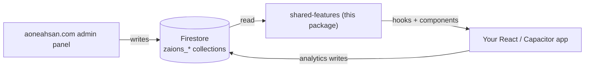

# Introduction

**`shared-features` is a React + Capacitor npm package that gives an entire portfolio of apps one shared layer for cross-promotion advertising, in-app broadcasts/notifications, feature flags, and common profile data.** You author the content once in the [aoneahsan.com](https://aoneahsan.com) admin panel; every consuming app reads it from shared Firestore collections and renders it with drop-in React components and hooks.

It exists to kill duplication. Instead of copy-pasting the same contact block, the same "try my other app" ad, or the same maintenance banner into ten projects, each app installs `shared-features`, points it at one Firebase project, and stays in sync automatically.

```bash
yarn add shared-features
```

## What you get

| System | What it does | Entry points |
|--------|--------------|--------------|
| **Feature Flags** | Toggle features, lock API versions, show deprecation warnings, flip a global maintenance mode, and target by platform/project. | `useFeatureFlags`, `useFeature`, `useFeatureGate` |
| **Advertising Campaigns** | Cross-promote your products with 5 ad components and 10 display variants, with impression/click analytics and frequency capping. | `AdPanel`, `AdSlider`, `AdBanner`, `AdModal`, `AdUpdateModal`, `useCampaigns` |
| **Broadcasts / Notifications** | Send banner, modal, toast, and bell notifications with priority levels and scheduling. | `BroadcastBanner`, `AnnouncementModal`, `useBroadcasts` |
| **Common Features** | Read shared contact, developer, social, address, payment, services, skills, testimonials, and project data. | `useContactInfo`, `useSocialLinks`, `ContactCard`, `FooterSection`, … |
| **Notification Events** | A typed event registry + a `{{placeholder}}` templating engine for app-driven notifications. | `eventRegistry`, `interpolate`, `useNotificationEvents` |

## How it fits together



The admin panel is the **author**. This package is the **reader** (plus analytics writer). Your app only ever depends on `shared-features` — it never talks to the admin UI directly.

## Honest scope

- It is a **client SDK**, not a backend. The authoring UI lives at aoneahsan.com, not in this package.
- `react`, `react-dom`, `firebase`, `@radix-ui/themes`, `zustand`, and `lucide-react` are **peer dependencies** — your app installs them; the package bundles none of them.
- Without a valid Firebase config the package stays **inert**: hooks return empty/idle state and components render `null` instead of throwing. Everything is guarded by `isInitialized()`.
- It is designed for the author's own portfolio (collections are prefixed `zaions_`), but it is MIT-licensed and reusable with your own Firebase project and admin tooling.

## Next steps

1. [Install the package and its peers](./getting-started/installation.md)
2. [Configure Firebase + initialize](./getting-started/configuration.md)
3. [Render your first ad and broadcast in 5 minutes](./getting-started/quick-start.md)
4. Browse the [API Reference](./reference/api-overview.md)

---

Built and maintained by [Ahsan Mahmood](https://aoneahsan.com) — [LinkedIn](https://linkedin.com/in/aoneahsan) · [GitHub](https://github.com/aoneahsan) · [npm](https://www.npmjs.com/~aoneahsan).
